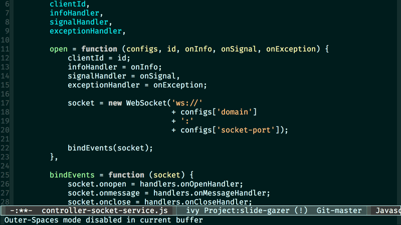

# outer-spaces

  

A minimalistic minor-mode to highlight redundant spaces

## Installation

### Manual

Save the file *outer-spaces.el* to disk and add the directory containing it to `load-path` using a command in your *.emacs* file like:

    (add-to-list 'load-path "~/.emacs.d/")

The above line assumes that you've placed the file into the Emacs directory '.emacs.d'.

Start the package with:

    (require 'outer-spaces)

### Marmalade

If you have Marmalade added as a repository to your Emacs, you can just install *outer-spaces* with

    M-x package-install outer-spaces RET

## Usage

Enable outer-spaces-mode in any buffer to highlight spaces in that buffer. Disabling minor-mode will unhighlight the highlighted spaces.
